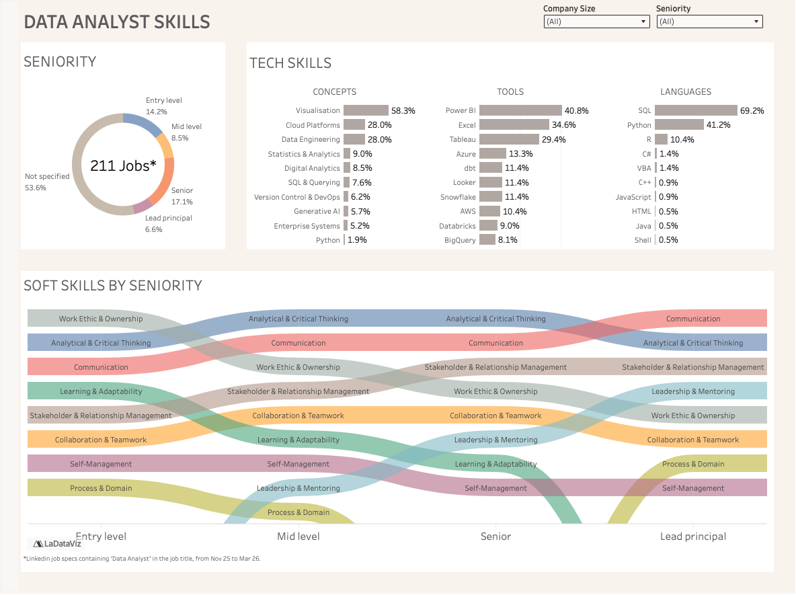

# Data Analyst Jobs Analysis

A portfolio project that scrapes, enriches, and analyses ~1,000 Data Analyst
job postings from LinkedIn UK, then visualises the results in Tableau Public.

## Project structure

```
jobs-analysis/
├── data/
│   ├── raw/              # CSV output from scraper (git-ignored)
│   └── enriched/         # CSV after NLP enrichment (git-ignored)
├── notebooks/
│   └── exploration.ipynb
├── src/
│   ├── scraper.py        # JobSpy collection script
│   ├── enricher.py       # NLP extraction pipeline (regex + LLM)
│   ├── db.py             # SQLite loader
│   └── classify.py       # Standalone field classifier
├── .env.example
├── .gitignore
├── requirements.txt
└── README.md
```

## Pipeline

Run the steps in order:

```bash
# Step 1 — Scrape ~1,000 LinkedIn job postings
python src/scraper.py

# Step 2 — Enrich with regex + LLM (requires ANTHROPIC_API_KEY)
python src/enricher.py

# Step 3 — Load into SQLite
python src/db.py
```

## Outputs

| File | Description |
|------|-------------|
| `data/raw/jobs_raw.csv` | Raw scraped job postings direct from LinkedIn |
| `data/enriched/jobs_enriched.csv` | Enriched dataset with skills, seniority, salary and remote policy extracted |
| `jobs.db` | Normalised SQLite database (companies, jobs, skills) |
| `data/exports/jobs_flat.csv` | One row per job — ready for Tableau |
| `data/exports/skills_flat.csv` | One row per skill with job and company context — ready for Tableau |
| `data/exports/companies_flat.csv` | One row per company with job count — ready for Tableau |


## Tech stack

- [JobSpy](https://github.com/Bunsly/JobSpy) — scraping
- [Anthropic Python SDK](https://github.com/anthropics/anthropic-sdk-python) — LLM enrichment
- pandas — data wrangling
- SQLite — storage
- Tableau Public — visualisation


## Key Insights (Summary)

### Seniority

More than half of postings (54%) carry no seniority label at all. Companies care more about
what you can do than where you sit on a ladder. Among roles that do specify a level, senior
and lead positions outnumber entry-level ones, so the market skews towards experienced hires.

### Hard Skills

**SQL is the price of entry.** It appears in 69% of all postings, no other skill comes close.
After that, Python is what separates candidates: it shows up in 41% of jobs, meaning
if you don't know it, you're locked out of nearly half the market.

On the tools side, Power BI dominates (41%), followed by Excel (35%) and Tableau (29%).
Excel still being second might surprise people. It doesn't excite technical analysts, but
hiring managers clearly still want it. Cloud platforms are equally pervasive: Azure, AWS,
BigQuery and Snowflake all feature in the top 10, and together cloud-related skills appear
in 28% of postings. dbt is the standout for data engineering work. If pipelines are part
of your role, it's the one tool to prioritise.

Visualisation skills, the ability to turn data into a decision, are expected in 58% of jobs.
It's not a nice-to-have, it's a core part of the job description.

### Soft Skills

Communication and analytical thinking appear consistently across every seniority level.
They are the baseline expectation for any data analyst role.

What changes as you progress is revealing. Work ethic, ownership and eagerness to learn
are heavily flagged in junior postings and quietly disappear at senior level. Not because
they stop mattering, but because companies assume they're already there. Show them early
and stop being asked to prove them.

Stakeholder and relationship management works in exactly the opposite direction. It barely
features in junior specs, but by the time you reach senior and lead level it becomes a
top-three requirement. The more senior you get, the less the job is about the data,
and the more it's about the people and decisions around it.

### What does the ideal candidate look like?

**Junior Data Analyst**

Start with SQL. It is non-negotiable and expected from day one. Add Python as early as
possible, because without it you're already excluded from a significant share of the market.
On the tools side, get comfortable with Excel and at least one visualisation platform,
Power BI being the most in-demand. Conceptually, you don't need to be a data engineer yet,
but knowing the basics of how data moves and understanding cloud environments will set you
apart from other entry-level candidates. Soft skills matter more at this stage than most
people expect: showing curiosity, a strong work ethic and a genuine willingness to learn
will be noticed and specifically looked for.

**Senior Data Analyst**

At senior level the technical bar is higher and broader. SQL and Python are assumed.
You'll be expected to work confidently with cloud platforms, Azure and Snowflake being the
most frequently mentioned, and to understand the full data stack, including transformation
tools like dbt. Visualisation remains central, but the expectation shifts from "can you
build a chart" to "can you turn analysis into a business decision." The biggest shift from
junior to senior is not technical, it's interpersonal. Stakeholder management becomes one
of the most demanded skills: the ability to communicate findings clearly, influence
decisions, and manage expectations across the business is what ultimately defines a
senior data analyst.

## Tableau Dashboard - Data Analyst Skills
👉 **[View interactive dashboard on Tableau Public](https://public.tableau.com/views/DataAnalystSkills/DataAnalystSkills?:language=en-GB&publish=yes&:sid=&:redirect=auth&:display_count=n&:origin=viz_share_link)**


